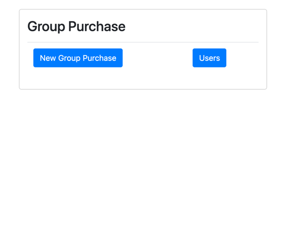

## Synopsis

My friends and I are Do It Yourself addicts. We buy a lot of material. Fortunately, we get to have good prices for large quantities on some websites. We just have to share the shipping fee.

I made an app that can upload a purchase CSV file, and produce a nice group bill   with the shipping fee calculated according to each buyer's amount of purchase.

### Here's a demo

Given that I have created myself and my friends in the app:

```
User      | Date Of Birth
----------+--------------
Bertrand  | 1995-04-03
Alice     | 1992-08-21
Clara     | 1997-01-10
Desmond   | 1994-09-09

```

When I upload a csv file : orders.csv, for a given date and a shipping fee

```
orders.csv

Item              | Unitp  | Qty | Amount | BUyer
------------------+--------+-----+--------+---------
pencils           |   0.50 |  20 |  10.00 | Bertrand
paper             |   1.50 |  25 |  37.50 | Alice
paper             |   1.80 |  50 |  90.00 | Desmond
laundry detergent |   2.00 |  10 |  20.00 | Clara
trash bags        |   4.30 | 100 | 430.00 | Clara
gift cards        |   8.00 |   1 |   8.00 | Bertrand
lightbulbs        |   1.00 |  10 |  10.00 | Clara

date : 2022-05-06
shipping : 40.00

```

Then I get a group bill for this purchase

```
Buyer    | Amount
---------+-------
Alice    |  39.98
Bertrand |  19.19
Clara    | 490.38
Desmond  |  95.95
---------+-------
TOTAL    | 645.50

```

What's nice about the app is that it respects our birthday rule:

**When the purchase is done on one of us' birthday, then he or she gets their part of the shipping fee by the others.**

# Database Setup

    brew install postgresql
    brew services start postgresql
    psql postgres
    \dt
    postgres=# \conninfo
    You are connected to database "postgres" as user "christophethibaut" via socket in "/tmp" at port "5432".


    CREATE ROLE grouppurchaseadmin WITH LOGIN PASSWORD 'butterfly';
    ALTER ROLE grouppurchaseadmin CREATEDB;

    \q
    psql -d postgres -U grouppurchaseadmin
    CREATE DATABASE GROUPPURCHASE;

## Initialize tables data

To have a running app, you need to initialize the tables.
Go to the project workspace 
```
 cd [your-local-path]/back_to_basics
```

You should have this hierarchy: 
```
ls -l
total 696
...
drwxr-xr-x    3 michelleavomo  staff      96 11 mai 13:12 postgres
... 

```
The file you need to populate your table is inside the postgres folder as shown below:
```
ls -l postgres
total 24
-rw-r--r--  1 michelleavomo  staff  9277 11 mai 13:12 pg_dump_grouppurchase.sql
```

Then from that path, execute the command below: 
 ```
  psql grouppurchase -f pg_dump_grouppurchase.sql

 ```

Now run you app. It works when your homepage (http://localhost:3000) looks like below: 


